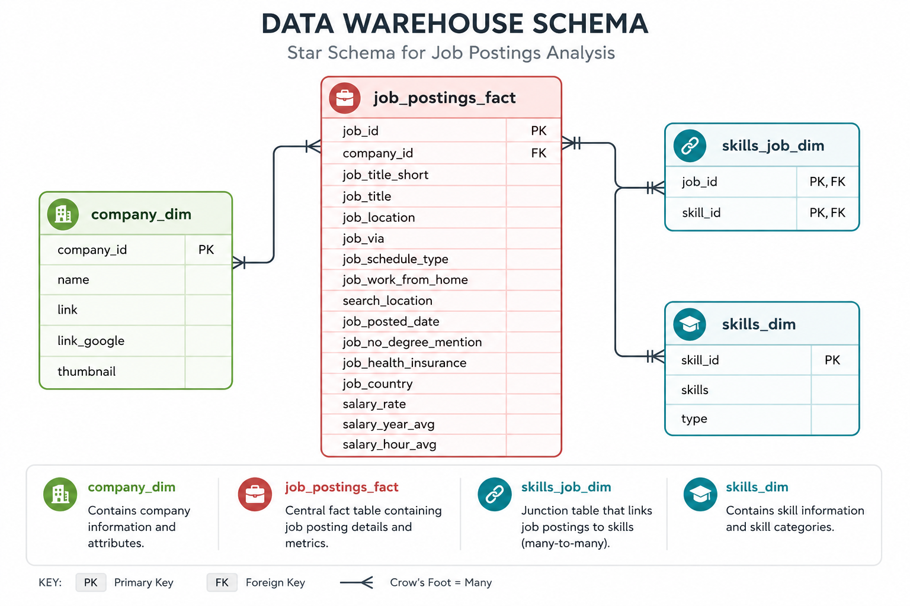
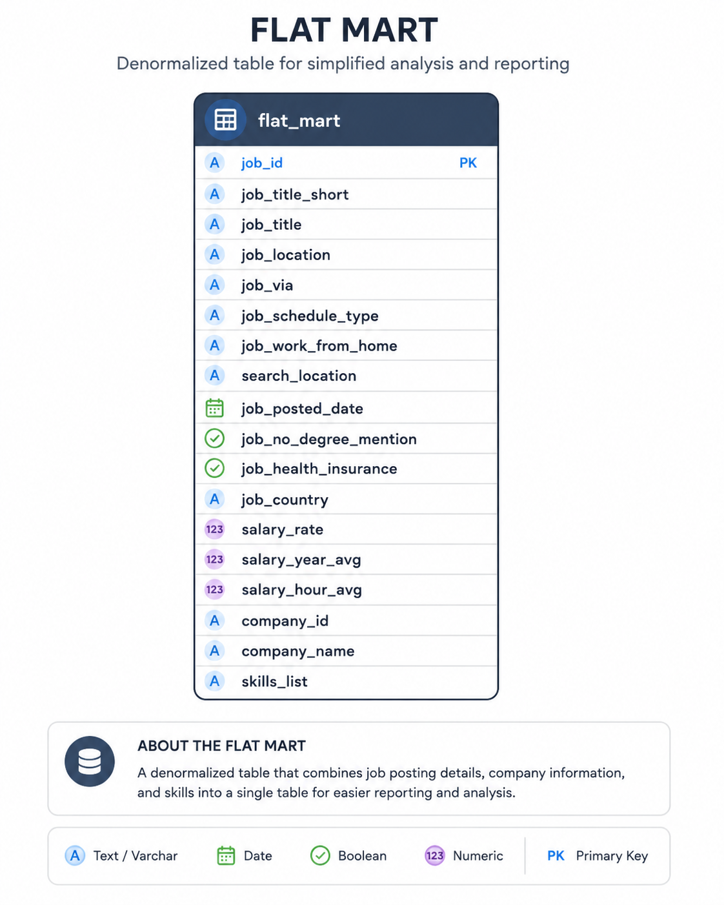
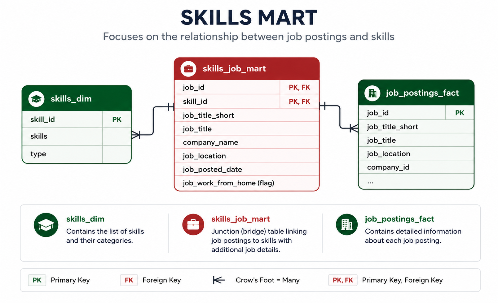
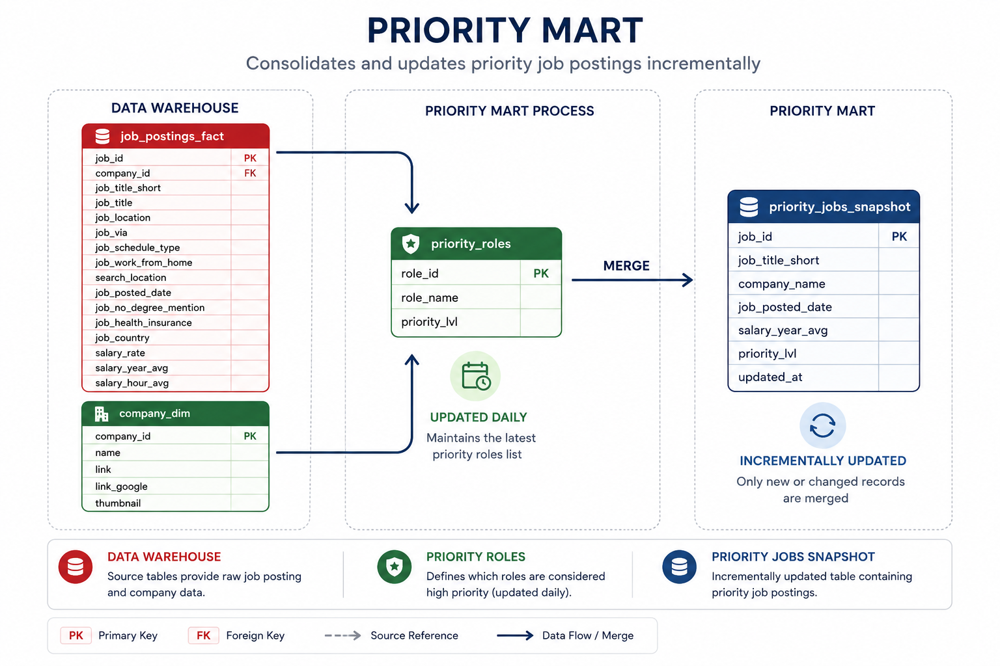

# Data Warehouse & Mart Build: Production ETL Pipeline

## Summary

An end-to-end data engineering pipeline that transforms raw CSV files from Google Cloud Storage into a normalized star schema warehouse, then builds analytical data marts

## Project Highlights

- Designed a normalized star schema warehouse
- Built automated ETL pipelines using DuckDB
- Implemented dimensional modeling techniques
- Created analytical data marts for reporting use cases
- Demonstrated production-style incremental updates using MERGE

## Executive Overview
- **Pipeline scope:** Built a complete **ETL pipeline** from raw CSVs to star schema warehouse to analytical marts
- **Data modeling:** Designed a **star schema** with fact tables, dimensions, and bridge tables for many-to-many relationships
- **ETL development:** Implemented **extract, transform, load** processes with idempotent operations and data quality checks
- **Mart architecture:** Created **specialized data marts** (flat, skills, priority) with additive measures and incremental update patterns

## Problem & Context
**Challenge:** Data teams need a single source of truth system-a data warehouse-to enable consistent, reliable analysis across the organization. Additionally, specialized data marts are required to optimize resources by pre-aggregating data for specific business use cases, reducing query complexity and improving performance for common analytical patterns. 

**Solution:** End-to-end ETL pipeline that extracts CSVs from cloud storage, normalizes them into star schema warehouse (separating facts from dimensions), and creates specialized data marts optimized for specific use cases (flat queries, skill demand analysis, priority role tracking).
 

## Tech Stack
- **Database:** DuckDB (file-based OLAP database with GCS integration via `httpfs`)
- **Language:** SQL (DDL for schema design, DML for data loading and transformation)
- **Data Model:** Star schema (fact + dimension + bridge tables)
- **Development:** VS Code for SQL editing + Terminal for DuckDB CLI execution
- **Automation:** Master SQL script for pipeline orchestration
- **Version control:** Git/GitHub for versioned pipeline scripts
- **Storage:** Google Cloud Storage for source CSV files

## Pipeline Architecture

The pipeline transforms job posting CSVs from Google Cloud Storage into a normalized star schema data warehouse, then builds specialized analytical data marts. BI tools (Excel, Power BI, Tableau, Python) consume from both the warehouse and marts

**Data Warehouse:** The data warehouse implements a star schema with `company_dim,` `skills_dim`, `job_postings_fact`, and `skills_job_dim` tables. 

- **SQL Files:**   
    - [`01_create_tables_dw.sql`](01_create_tables_dw.sql) - Defines star schema with 4 core tables
    - [`02_load_schema_dw.sql`](02_load_schema_dw.sql) - Extracts CSVs from GCS and loads into warehouse tables
- **Purpose:** 
    - Star schema serving as a single source of truth for analytical queries
- **Grain:** 
    - One row per job posting in the fact table (`job_postings_fact`)

### Flat Mart
**Denormalized table with all dimensions for ad-hoc inquires**

- **SQL File:** 
    - [`03_create_flat_mart.sql`](03_create_flat_mart.sql) - Builds denormalized table with all dimensions joined
- **Purpose:** 
    - Denormalized table for quick ad-hoc queries
- **Grain:** 
    - One row per job posting with all dimensions joined

### Skills Mart
Time-series skill demand analysis with additive measures

- **SQL File:** 
    - [04_create_skills_mart.sql](04_create_skills_mart.sql) - Builds time-series skill demand mart
- **Purpose:** 
    - Time-series analysis of skill demand over time with additive measures
- **Grain:** 
    - `skill_id + month_start_date + job_title_short`
- **Key Features:** 
    - All measures are additive (counts/sums) for safe re-aggregation

### Priority Mart
Priority role tracking with incremental updates using `MERGE` operations

- **SQL Files:**
    - [`05_create_priority_mart.sql`](05_create_priority_mart.sql) - Initial build of priority roles and jobs snapshot
    - [`06_update_priority_mart.sql`](06_update_priority_mart.sql) - **Incremental update using `MERGE`** (upsert pattern)
- **Purpose:** 
    - Track priority roles and job snapshots with incremental update capabilities. 
- **Grain:** 
    - One row per job posting with priority level assignment
- **Key Features:** 
    - **`MERGE` operations for incremental updates** - demonstrates production-ready upsert patterns (`INSERT`, `UPDATE`, `DELETE` in single statement)

## Data Engineering Skills Demonstrated

### ETL Pipeline Development
- **Extract:** Direct CSV loading from Google Cloud Storage using DuckDB's `httpfs` extension 
- **Transform:** Data normalization, type conversion (`CAST`, `DATE_TRUNC`), and quality filtering
- **Load:** Idempotent table creation with `DROP TABLE IF EXISTS` patterns
- **Incremental Updates:** MERGE operations for upsert patterns (INSERT, UPDATE, DELETE in single statement)
- **Orchestration:** Master SQL script (`build_dw_marts.sql`) for automated pipeline execution

## Dimensional Modeling Concepts

### Star Schema Design
The warehouse follows a star schema design centered around the `job_postings_fact` table with supporting dimension tables:

* `company_dim`
* `skills_dim`

### Bridge Tables
Many-to-many relationships are managed through bridge tables:

* `skills_job_dim`
* `bridge_company_location`
* `bridge_job_title`

### Grain Definition
Fact tables were designed with explicit granularity to support consistent aggregation:

* Skill demand by month (`skill + month`)
* Company, title, and location demand by month (`company + title + location + month`)

### Additive Measures

The Skills Mart was designed using additive measures that can be safely aggregated across dimensions without introducing calculation errors.

Examples:

- Job posting counts
- Skill demand counts
- Monthly posting totals

This design supports flexible reporting and downstream BI tool consumption.

## SQL Advanced Techniques

### DDL Operations

Used Data Definition Language (DDL) commands for schema and table management:

* `CREATE TABLE`
* `DROP TABLE`
* `CREATE SCHEMA`

### DML Operations

Used Data Manipulation Language (DML) commands to load and transform data from CSV sources:

* `INSERT INTO ... SELECT`
* Explicit column mapping during data ingestion
* Fact and dimension table population

### MERGE Operations

Implemented incremental update patterns using:

* `MERGE INTO`
* `WHEN MATCHED`
* `WHEN NOT MATCHED`
* `WHEN NOT MATCHED BY SOURCE`

These techniques support production-style upsert workflows and snapshot maintenance.

### Common Table Expressions (CTEs)

Used CTEs to:

* Simplify complex transformations
* Improve query readability
* Generate intermediate datasets
* Create boolean flags and derived metrics

### Date Functions

Created temporal dimensions and reporting periods using:

* `DATE_TRUNC('month')`
* `EXTRACT(quarter)`

Additional date-based transformations supported trend analysis and mart creation.

### String Functions

Used string manipulation functions including:

* `STRING_AGG`
* `REPLACE`

These functions were used for data cleaning, aggregation, and presentation.

### Boolean Logic

Implemented conditional business logic using:

* `CASE WHEN`

Examples include:

* Remote work indicators
* Health insurance availability
* Degree requirement classifications
* Priority role categorization

## Data Quality & Production Practices

### Idempotency

All ETL and mart-building scripts were designed to be safely rerunnable without creating duplicate records or unintended side effects.

Examples include:

* `CREATE OR REPLACE`
* `DROP TABLE IF EXISTS`
* Controlled reload and refresh processes

This approach supports reliable development, testing, and deployment workflows.

### Data Validation

Validation queries were used throughout the pipeline to verify:

* Row counts
* Table population success
* Referential integrity
* Transformation accuracy

These checks help ensure data quality at each stage of processing.

### Type Safety

Appropriate data types were selected for each business attribute:

| Data Type   | Usage                                  |
| ----------- | -------------------------------------- |
| `VARCHAR`   | Text attributes and descriptive fields |
| `INTEGER`   | Identifiers and key columns            |
| `DOUBLE`    | Salary and numeric metrics             |
| `BOOLEAN`   | Flag indicators                        |
| `TIMESTAMP` | Temporal and audit tracking fields     |

Proper typing improves data integrity, storage efficiency, and analytical performance.

### Schema Organization

The warehouse was organized into logical marts and schemas to separate analytical use cases:

* `flat_mart`
* `skills_mart`
* `priority_mart`
* `company_mart`

This separation improves maintainability and supports domain-specific reporting.

### Error Handling & Troubleshooting

Scripts were developed with structured execution patterns and validation checkpoints to simplify troubleshooting.

Examples include:

* Clear execution sequencing
* Verification queries after data loads
* Validation of foreign key relationships
* Incremental testing of transformations

This approach helped identify and resolve issues related to schema design, data loading, and warehouse construction.

## Key Outcomes

- Built a normalized star schema warehouse from raw CSV data
- Implemented automated ETL processes using DuckDB
- Created three analytical marts optimized for different reporting needs
- Demonstrated incremental update patterns using MERGE operations
- Applied dimensional modeling principles including fact tables, dimensions, and bridge tables

## Lessons Learned

- Importance of preserving raw source data rather than filtering during ingestion
- Benefits of dimensional modeling for analytical workloads
- How bridge tables support many-to-many relationships
- Tradeoffs between normalized warehouses and denormalized marts
- Implementation of production-style incremental update patterns using MERGE
- Data validation techniques for maintaining pipeline reliability

## Original project/tutorial inspiration from:
- **Luke Barousse YouTube Channel:** (https://youtube.com/@lukebarousse?si=Wy_og1il961aWH2z)

