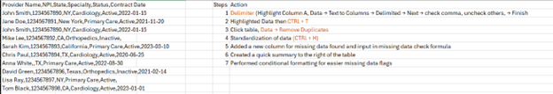

# Healthcare Data Quality Analysis

This project expanded an Excel-based provider data audit into SQL using DuckDB/MotherDuck to perform deeper healthcare data validation, classification, and KPI reporting.

The project focused on identifying missing provider identifiers, incomplete contract information, and overall data quality issues through structured SQL queries and analytical reporting techniques.

While the original audit process was managed manually in Excel, this project recreated and improved the workflow using SQL to demonstrate more scalable and repeatable data validation workflows.

## Project Goals
- Import and review provider audit data in SQL
- Create a cleaned SQL table with readable field names
- Identify missing NPI values and contract dates
- Group provider records by state and data issue type
- Classify records based on data completeness and risk level
- Calculate an overall data completeness percentage
- Produce query-based summaries to support data quality reporting

## Tools Used
- SQL
- Excel
- DuckDB/MotherDuck
- Visual Studio Code

## Analysis Overview
1. Data Cleaning & Standardization
    - Renamed and standardized columns for readability and analysis
    - Validated imported provider records for consistency
2. Data Quality Validation
    - Identified missing NPI values
    - Flagged incomplete contract start/end dates
    - Reviewed records for incomplete or inconsistent provider information
3. Classification & Reporting
    - Grouped provider records by state and issue category
    - Used conditional logic to classify records by data completeness and risk level
    - Generated KPI-style summaries for reporting purposes
4. Data Completeness Metrics
    - Calculated overall data completeness percentages
    - Measured frequency of missing or incomplete values across key fields

## Key Insights
- Identified provider records with missing NPIs and incomplete contract data that could impact operational reporting accuracy
- Demonstrated how SQL can streamline and scale manual Excel-based auditing workflows
- Created categorized summaries that improved visibility into data quality issues by state and provider group
- Built query-driven reporting methods that could support healthcare auditing and compliance workflows
- Showed how structured SQL validation can improve consistency and reduce manual review effort

## SQL Skills Demonstrated
### Query Design
- Data filtering using `WHERE` clauses
- Aggregations using:
    - `COUNT()`
    - `ROUND()`
    - `AVG()`
- Sorting and grouping with:
    - `GROUP BY`
    - `ORDER BY`
### Data Validation Techniques
- NULL value detection and filtering
- Conditional classifications using `CASE WHEN`
- Data completeness calculations
- Record categorization based on validation rules
### Analytical Techniques
- KPI metric calculations
- Data quality reporting
- State-level grouped analysis
- Issue classification and summarization

## Before and After
### Original Dataset

## Results 
- Identified X provider records with missing NPIs
- Calculated overall data completeness percentage across provider records
- Created SQL-driven reporting summaries for operational review

