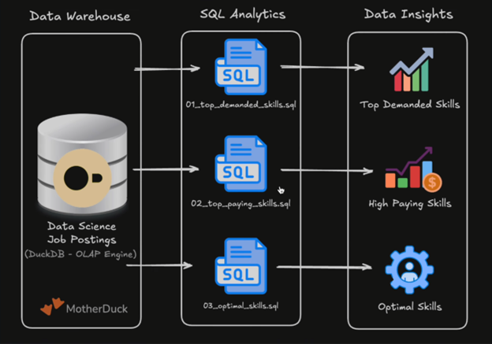

# SQL Data Engineering Projects

The following projects are a collection of my studies, showcasing my SQL skills so far and to practice my skills w/ data engineering tools. 

>Click the project name below to view the tools that I used to build these.

## Projects

### [1. EDA](/1_EDA/) - Exploratory Data Analysis

SQL-driven analysis of data engineer and data analyst job market trends using advanced querying techniques. 