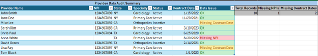
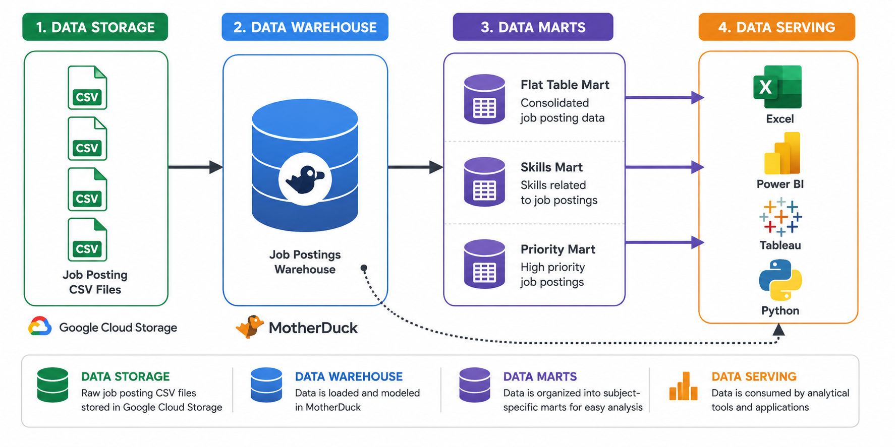

# SQL Data Engineering Projects

The following projects document my progression in SQL, analytics, and data engineering concepts. Each project focuses on a different stage of the data lifecycle, from data validation and business analysis to data warehousing and ETL development.

> Click a project name below to explore the SQL queries, architecture diagrams, implementation details, and project results.

## Projects

### [Healthcare Data Quality Analysis](/Healthcare_Data_Quality_Analysis/) - Healthcare Analytics & Data Validation

Automated a manual Excel-based provider audit process using SQL to identify missing provider identifiers, incomplete contract data, and overall data quality issues. This project demonstrates how SQL can be used to support healthcare data governance, reporting accuracy, and operational compliance workflows.

**Skills:** Data validation, KPI reporting, healthcare analytics, data quality assessment, CASE logic, aggregations, SQL reporting, business rule classification

---

### [1. EDA](/1_EDA/) - Exploratory Data Analysis - Business & Labor Market Analytics

SQL-driven analysis of data engineer and data analyst job market trends using advanced querying techniques. This project explores skill demand, salary trends, and workforce analytics to identify the most valuable technical skills based on both compensation and market demand.

**Skills:** Multi-table joins, aggregations, salary analysis, workforce analytics, KPI reporting, labor market research, decision support analysis

---

### [2. DW Mart Build](./2_DW_Mart_Build/) - Data Pipeline, Data Warehouse & Data Marts

Built an end-to-end ETL pipeline that transforms raw CSV files into a dimensional star-schema warehouse and multiple analytical data marts using DuckDB and MotherDuck. The project demonstrates data modeling, warehousing concepts, and production-oriented data engineering practices.

**Skills:** Dimensional modeling, ETL pipeline development, data warehousing, star schema design, data mart architecture, incremental updates, production practices

---

## Portfolio Progression

### Project 1: Data Quality & Validation

Focused on healthcare data auditing, validation, KPI reporting, and business rule implementation.

### Project 2: Business Analysis & Insights

Focused on SQL-driven analysis, salary research, workforce analytics, and data-driven decision support.

### Project 3: Data Warehousing & ETL

Focused on dimensional modeling, data pipelines, warehouse architecture, and analytical data marts.

### Next Phase: Power BI & Data Visualization

Planned focus on dashboard development, business intelligence reporting, and visual storytelling using the datasets and analytical workflows developed throughout these projects.
